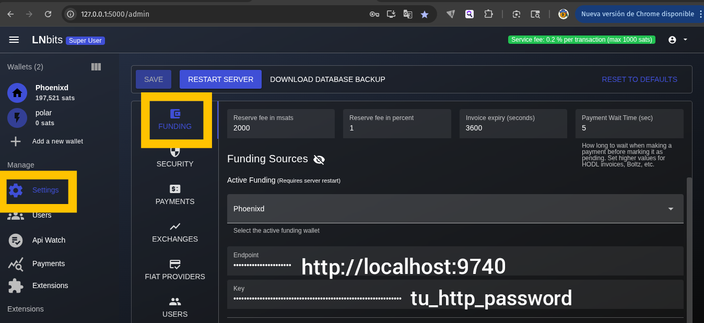

# LNbits + Phoenixd ⚡

> ⚡ This project was inspired by the excellent [`lnbits-phoenixd`](https://github.com/bitkarrot/lnbits-phoenixd) repository by [@bitkarrot](https://github.com/bitkarrot), which provides a Docker-based setup to run Phoenixd with LNbits. However, since Docker access and downloads are heavily restricted or unreliable in Cuba, we created this simplified and updated solution using Poetry and native binaries, fully operable in local environments without relying on Docker.


**Autocustodial Lightning Backend with LNbits and Phoenixd on your Linux x64 machine**

---

## 🖥️ Platform Compatibility

| Platform       | Status   | Notes                                        |
|----------------|----------|----------------------------------------------|
| Linux x64      | ✅ Tested | Main supported environment                   |
| macOS          | ⚠️ Untested | Contributions welcome for this platform     |
| Windows        | ⚠️ Untested | Contributions welcome for this platform     |
| Linux ARM64    | ⚠️ Untested | Contributions welcome for this platform     |

---

## 🧾 About the Project

This repository allows you to run LNbits locally with [Phoenixd](https://github.com/ACINQ/phoenixd) as a Lightning Network backend. It is designed to provide a **self-custodial**, **lightweight**, and **connectivity-resilient** setup ideal for merchants or users in regions with unstable or limited internet access.

LNbits is a versatile Lightning wallet server offering a rich collection of extensions such as:

🧾 Point of Sale (POS) interfaces for physical stores

💸 TipJar to receive donations

⚡ LNURL support for flexible and interoperable payments

➗ Split Payments, 🔗 Withdraw Links, 📴 Offline QR invoices, and more

These tools make LNbits an excellent frontend for merchant adoption, community use, or experimentation—especially when paired with a backend like Phoenixd that performs well under poor connectivity conditions.

---

### 🛡️ Why This Setup?

- 👐 Self-custody: You retain full control over your Lightning funds using Phoenixd—no custodial service required.
- 🌍 Excellent connectivity: Phoenixd connects to ACINQ's robust Electrum servers, which handle poor or unstable internet better than Neutrino-based clients.
- ⚡ Fast sync: Even with limited bandwidth, Phoenixd remains functional and responsive.
- 🤖 Auto-liquidity: Once a minimum of 21,000 sats (service fee) + on-chain mining fees is paid, Phoenixd will automatically open an inbound 2M satoshi channel from ACINQ.
- 💡 No channel management required: Unlike other Lightning solutions, users don't need to open or manage their own channels or provide outbound liquidity upfront.
- 🛍️ Merchant-ready: LNbits offers multiple extensions tailored for commerce (POS, offline payments, split invoices), making it ideal for merchants, especially in local economies.

Phoenixd connects to remote Electrum servers maintained by ACINQ, which are generally more tolerant of poor connectivity than Neutrino clients (like those used by LND). Electrum servers perform well even with intermittent or low-bandwidth connections, whereas Neutrino clients typically require a stable and fast internet connection to sync and function properly.

>🔧 This makes the Phoenixd + LNbits stack a practical, self-hosted Lightning solution for low-resource environments and merchants in underserved regions.
---

## ✨ Key Features

- 🔐 Self-custodial Lightning backend
- 💡 Designed for limited connectivity using Electrum servers
- ⚙️ LNbits local server with rich extensions: POS, LNURL, Split Payments, etc.
- 🖥️ Built with `Poetry` and `OpenJDK 21`
- ⚡ Uses Phoenix’s auto-liquidity model with fee credit accumulation
- 📦 Easy to replicate and share

---

## 📦 Requirements

- Linux x64 machine
- Python 3.10+
- Poetry
- OpenJDK 21+

---

## 🛠️ Installation Steps (Linux x64)

### 1. Clone Phoenixd and Build

```bash
mkdir ~/apps && cd ~/apps
git clone https://github.com/ACINQ/phoenixd.git
cd phoenixd
./gradlew linuxX64DistZip
unzip build/distributions/phoenixd-*.zip
```

After unzipping, `phoenixd` and `phoenix-cli` binaries will be located in:

```bash
~/apps/phoenixd-0.6.2-linux-x64/
```

🔗 You can always get the latest Phoenixd from: https://github.com/ACINQ/phoenixd


### 2. Run Phoenixd

```bash
cd ~/apps/phoenixd-0.6.2-linux-x64/
./phoenixd
```

Use `ls -la ~/.phoenix/` to see your `phoenix.conf` config file.

Phoenix now uses `http_password` instead of the old `api_key`.

### 3. Clone LNbits and Set Up Locally

```bash
git clone https://github.com/lnbits/lnbits.git
cd lnbits
cp .env.example .env
```
Edit your `.env` file and replace or add the following:

```env
LNBITS_BACKEND_WALLET_CLASS=PhoenixdWallet
PHOENIXD_API_ENDPOINT=http://localhost:9740/
PHOENIXD_API_PASSWORD=your_http_password
```
Install and run:

```bash
poetry install
poetry run uvicorn lnbits.__main__:app --reload --host 0.0.0.0 --port 5000
```
LNbits will be available at:
➡️ http://127.0.0.1:5000

🔗 Official LNbits repository: https://github.com/lnbits/lnbits

---
🧩 LNbits Interface Configuration
After accessing LNbits at `http://127.0.0.1:5000`, follow these steps:

1. Go to the sidebar and open Settings

2. Click on Funding Source

3. Under Active Funding, select Phoenixd

Set the following:

```bash
Funding Sources
Active Funding (Requires server restart)

Select the active funding wallet: Phoenixd

Endpoint: http://localhost:9740/
Key: Your http_password
```
4. Save and restart the LNbits server.

You can use the following image as a reference:

<div align="center">  </div>

---

## 🧪 Auto-Liquidity Behavior

Phoenixd opens channels only after you accumulate enough fee credit:

* Minimum channel size: 2,000,000 sats

* Service fee: 1% (21,000 sats)

* Plus on-chain mining fee (varies depending on mempool conditions)

* You can make small payments that accumulate as fee credit until the threshold is reached.

---

## 📁 Project Structure (File Locations)

```bash
~/  # Your home directory
├── apps/
│   └── phoenixd-0.6.2-linux-x64/
│       ├── phoenixd          # Phoenix daemon binary
│       ├── phoenix-cli       # CLI utility to interact with Phoenixd
│       └── ...               # Other Phoenixd files
├── lnbits/
│   ├── .env                  # LNbits environment configuration
│   ├── lnbits/               # LNbits main codebase
│   ├── requirements.txt      # Python dependencies (optional if using Poetry)
│   └── ...                  # Other LNbits files
```
⚠️ Phoenixd and LNbits are installed outside of this documentation repo. Make sure the .env file is configured to match your Phoenixd instance (e.g., http://localhost:9740).

---

## 🧑‍💻 Contributing

This specific guide is built and tested on Linux x64.

We welcome contributions such as:

* Suggestions to improve this guide

* Companion documentation for other platforms (macOS, ARM, Windows)

To contribute:

1. Fork the repository

2. Create a new branch `(git checkout -b feature/my-platform-guide)`

3. Add your guide or improvement

4. Commit your changes `(git commit -m "Add guide for macOS")`

5. Push to your fork and open a Pull Request

---

##📄 License

MIT License — see the [LICENSE](LICENSE) file.

---

## 🌐 Resources

- [Phoenixd - GitHub](https://github.com/ACINQ/phoenixd)
- [Phoenix Server Docs](https://phoenix.acinq.co/server)
- [LNbits - GitHub](https://github.com/lnbits/lnbits)
- [LNbits Documentation](https://docs.lnbits.com/)
